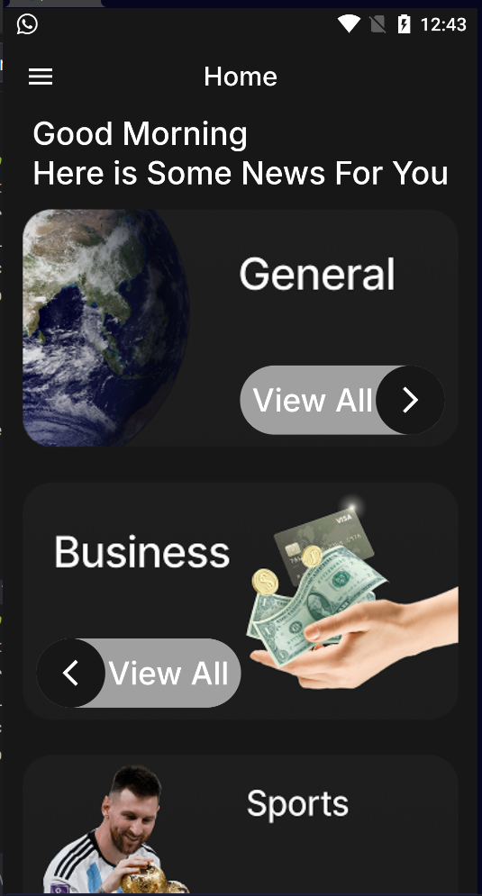
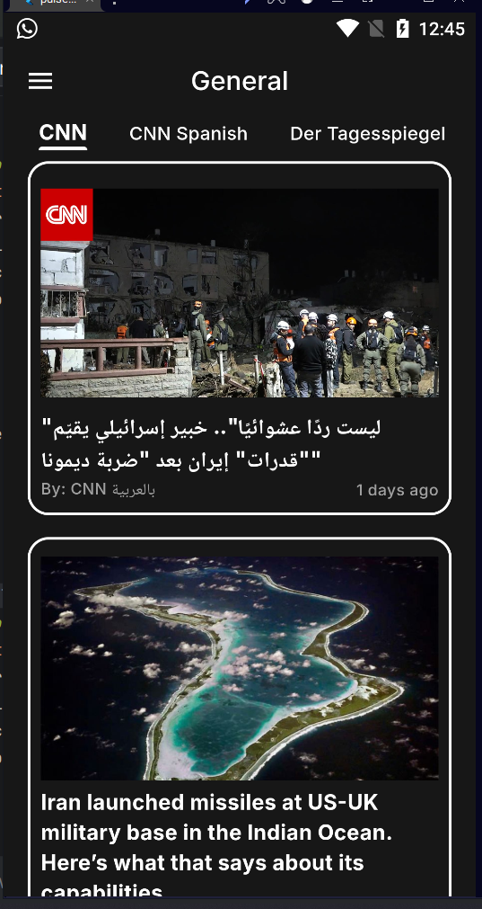
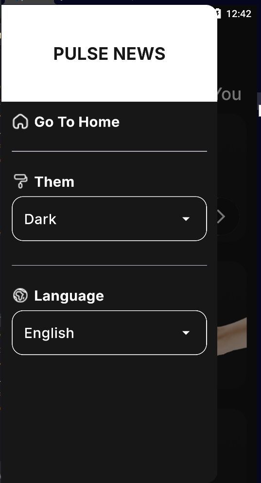

# 📰 Pulse News

A clean, modern Flutter news application built with **Clean Architecture**, **Bloc**, and a flexible **HTTP abstraction layer** that allows switching between network clients without touching business logic.

---

## 📱 Screenshots

| Home | Category | Settings |
|------|----------|----------|
|  |  |  |

---

## ✨ Features

- 🗂️ Browse news across multiple categories (General, Business, Sports & more)
- 🔍 Filter articles by news source within each category
- 🌙 Dark & Light theme support
- 🌍 Multi-language support
- 🖼️ Smooth image loading with caching
- 🕐 Relative timestamps on articles

---

## 🏗️ Architecture

This project follows **Clean Architecture** principles with a clear separation of concerns:

```
lib/
├── api/                  # Network layer
│   ├── model/            # API response models
│   ├── apis_manager.dart # HTTP client implementation
│   ├── dio_manager.dart  # Dio client implementation
│   ├── end_points.dart   # API endpoints
│   ├── app_exception.dart
│   └── constants.dart
├── core/                 # Shared utilities & base classes
├── data/                 # Repositories & data sources
├── di/                   # Dependency Injection
├── ui/                   # Presentation layer (Screens & Bloc)
└── main.dart
```

---

## 🔄 HTTP Abstraction Layer (Strategy Pattern)

One of the key architectural decisions in this project is the **HTTP abstraction layer**.

Instead of hardcoding a single HTTP package throughout the app, the `repository_impl` depends on an **abstracted network interface**. This means:

- Switching from `Dio` to `http` (or any other package) requires changing **one line in the DI layer** — not touching any business logic or repository code.
- Each client (`DioManager`, `ApisManager`) is independently implemented and injectable.
- This follows the **Dependency Inversion Principle** from SOLID.

> 💡 This design allows the team to swap HTTP clients in seconds — no refactoring needed.

---

## 🛠️ Tech Stack

| Layer | Technology |
|-------|-----------|
| UI | Flutter & Dart |
| State Management | Bloc |
| Network (Primary) | Dio |
| Network (Fallback) | HTTP Package |
| Dependency Injection | get_it |
| Image Caching | cached_network_image |
| Responsive UI | flutter_screenutil |
| Typography | Google Fonts |
| Timestamps | timeago |
| Splash Screen | flutter_native_splash |

---

## 🚀 Getting Started

**1. Clone the repository**
```bash
git clone https://github.com/ShadyAshraf1212/Pulse-News.git
cd Pulse-News
```

**2. Add your API key**
```dart
// lib/api/constants.dart
const String apiKey = 'YOUR_API_KEY';
```

**3. Run the app**
```bash
flutter pub get
flutter run
```

---

## 🔑 API

This app uses [NewsAPI](https://newsapi.org) — get your free API key from their website.

---

## 📐 SOLID Principles Applied

| Principle | How |
|-----------|-----|
| **S** — Single Responsibility | Each class has one job (DioManager handles requests only) |
| **O** — Open/Closed | Add new clients without modifying existing ones |
| **D** — Dependency Inversion | Repositories depend on abstractions, not concrete HTTP clients |

---

## 📄 License

MIT License — see [LICENSE](LICENSE) for details.
